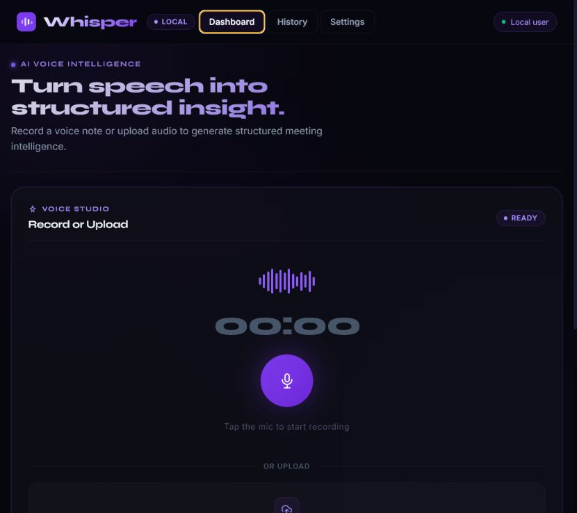
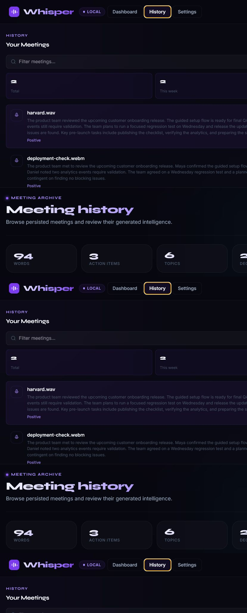
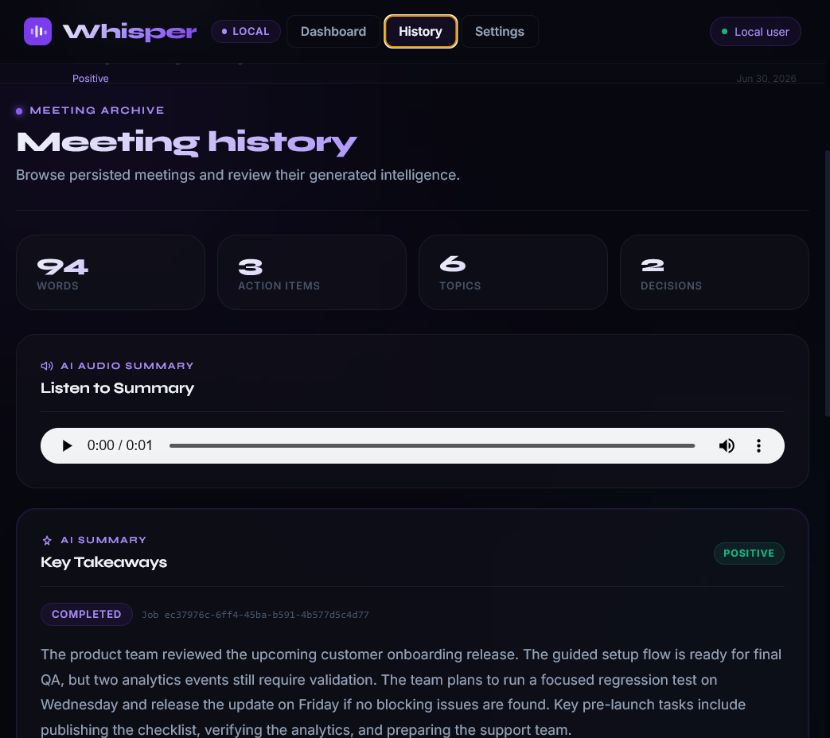
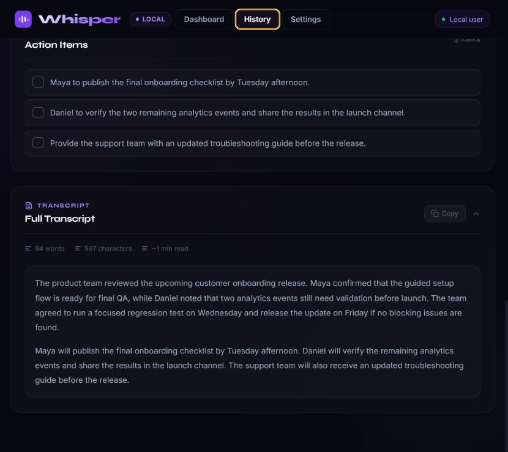
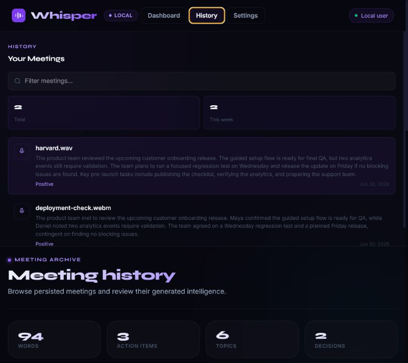
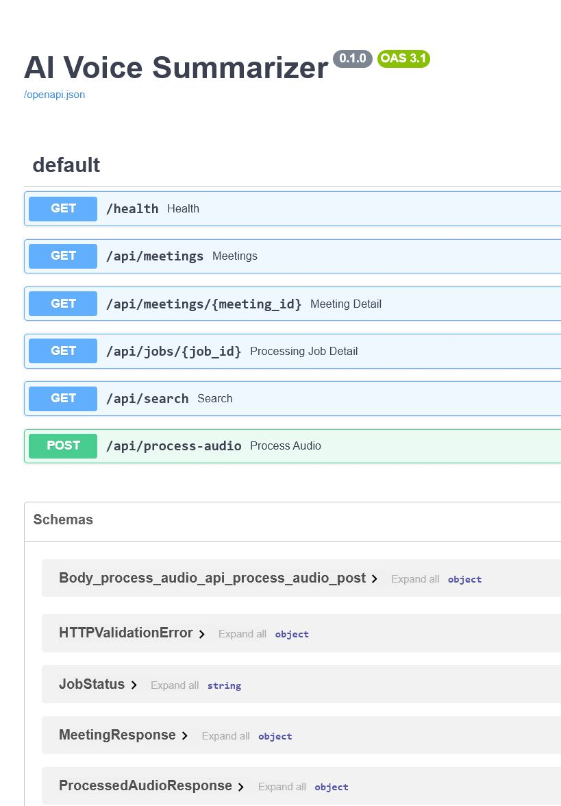
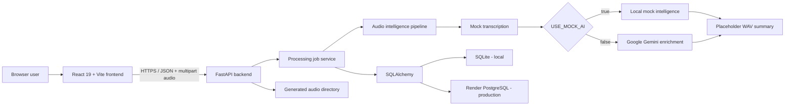
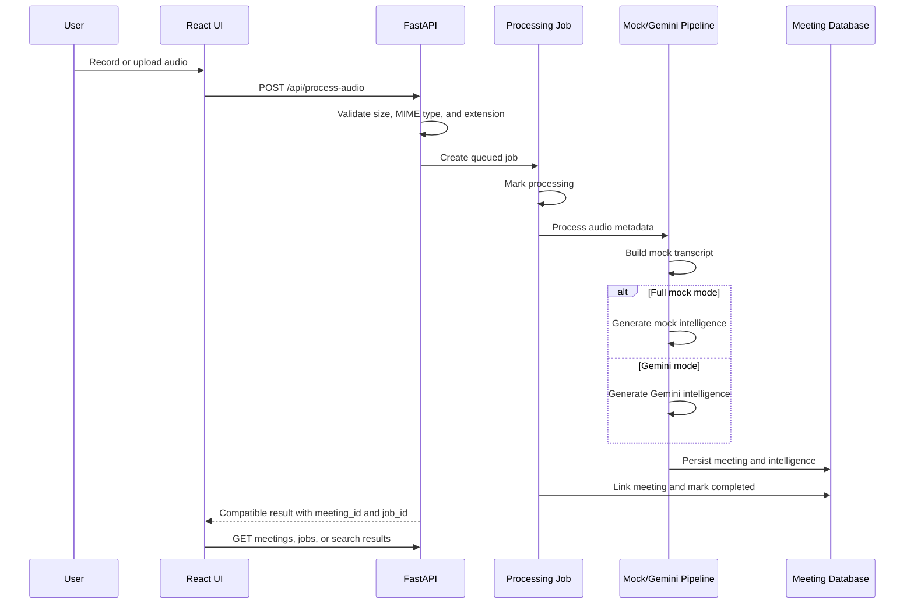

# Whisper

Whisper is a full-stack audio intelligence platform that turns uploaded or browser-recorded audio into structured, searchable meeting records. It combines a React workspace with a FastAPI API, persistent job and meeting storage, and optional Gemini enrichment.

> Transcription and generated speech are currently mocked. In Gemini mode, Gemini generates the summary, action items, topics, decisions, and sentiment from the mock transcript. Real speech-to-text and production text-to-speech are not implemented.

## Live Project

- [Open Whisper](https://whisper-sandy-gamma.vercel.app)
- [Backend API](https://whisper-api-09yx.onrender.com)
- [Interactive API docs](https://whisper-api-09yx.onrender.com/docs)
- [Health check](https://whisper-api-09yx.onrender.com/health)

The Render free service can take up to a minute to wake after inactivity.

## Features

- Browser audio recording and file upload
- Validated audio size, MIME type, and extension
- Mock mode with no provider key required
- Gemini-generated summaries, action items, topics, decisions, and sentiment
- Persistent meetings and processing jobs with SQLAlchemy
- SQLite for local development and PostgreSQL for deployment
- Meeting history, detail retrieval, and full transcript views
- Search across filenames, transcripts, summaries, actions, topics, and decisions
- Job states for queued, processing, completed, and failed work
- Structured API errors and environment-controlled CORS
- Worker-ready processing boundary with synchronous execution today

## Screenshots

### Dashboard



### Processed Meeting



### Summary, Decisions, and Action Items



### Full Transcript



### Meeting History



### API Documentation



## Architecture



## Processing Flow



The current dispatcher executes synchronously so `POST /api/process-audio` still returns the complete result. Its task boundary is prepared for a future external worker, but Redis-backed execution is not implemented.

## Tech Stack

| Layer | Technology |
| --- | --- |
| Frontend | React 19, Vite 7, Tailwind CSS 4, Framer Motion |
| Backend | FastAPI, Python 3.11+, Uvicorn |
| Data | SQLAlchemy, SQLite, PostgreSQL, Psycopg |
| Intelligence | Google Gemini or deterministic mock data |
| Deployment | Vercel, Render Web Service, Render PostgreSQL |

## API

| Method | Endpoint | Purpose |
| --- | --- | --- |
| `GET` | `/health` | Return service and environment health |
| `POST` | `/api/process-audio` | Validate an upload, process it, and persist the result |
| `GET` | `/api/jobs/{job_id}` | Return processing status and linked meeting ID |
| `GET` | `/api/meetings` | List persisted meetings |
| `GET` | `/api/meetings/{meeting_id}` | Return one meeting with all intelligence fields |
| `GET` | `/api/search?q={query}` | Search meeting content and metadata |
| `GET` | `/generated/{filename}` | Serve a generated placeholder audio summary |
| `GET` | `/docs` | Open the interactive OpenAPI documentation |

## Local Setup

### Requirements

- Python 3.11+
- Node.js 20+
- npm
- A user-provided Gemini API key only for Gemini mode

```powershell
git clone https://github.com/ayushxt25/Whisper.git
cd Whisper
git switch feature/audio-intelligence-platform
```

### Backend

```powershell
cd backend
python -m venv .venv
.\.venv\Scripts\Activate.ps1
python -m pip install -r requirements.txt
Copy-Item .env.example .env
python -m uvicorn main:app --host 127.0.0.1 --port 8000
```

### Frontend

In a second terminal:

```powershell
cd frontend
npm install
Copy-Item .env.example .env
npm run dev
```

Open `http://localhost:5173`. The local API and docs run at `http://127.0.0.1:8000` and `http://127.0.0.1:8000/docs`.

## Configuration

Never commit `.env` files or expose provider keys in frontend variables. Start from the committed `.env.example` files.

### Backend

| Variable | Local default | Purpose |
| --- | --- | --- |
| `APP_ENVIRONMENT` | `development` | Runtime environment label |
| `USE_MOCK_AI` | `true` | Select full mock mode when true |
| `GEMINI_API_KEY` | placeholder | User-provided Gemini key; required only when mock mode is false |
| `GEMINI_MODEL` | `gemini-3.5-flash` | Gemini model identifier |
| `DATABASE_URL` | `sqlite:///./whisper.db` | SQLite locally or PostgreSQL in production |
| `PROCESSING_MODE` | `sync` | Current processing strategy |
| `REDIS_URL` | `redis://localhost:6379/0` | Reserved for future worker infrastructure |
| `GENERATED_DIR` | `generated` | Placeholder audio output directory |
| `MAX_UPLOAD_SIZE_MB` | `25` | Maximum accepted upload size |
| `CORS_ORIGINS` | local frontend origins | Comma-separated allowed browser origins |
| `CORS_ALLOW_CREDENTIALS` | `false` | Credential policy for CORS |

Accepted upload extensions and MIME types are configurable through `ALLOWED_AUDIO_EXTENSIONS` and `ALLOWED_AUDIO_MIME_TYPES`.

### Frontend

```env
VITE_API_BASE_URL=http://localhost:8000
```

## Provider Modes

### Mock Mode

Set `USE_MOCK_AI=true`. Requests use a realistic fixed transcript, mock structured intelligence, and a placeholder WAV response. No provider key is needed, and meetings/jobs are persisted normally.

### Gemini Mode

Set `USE_MOCK_AI=false` and provide your own `GEMINI_API_KEY`. The pipeline continues to use mock transcription and placeholder audio, while Gemini generates the summary, action items, topics, decisions, and sentiment. The key must remain server-side.

## Deployment

### Render PostgreSQL

Create a PostgreSQL database and provide its internal connection URL as `DATABASE_URL`. The backend accepts `postgres://`, `postgresql://`, and `postgresql+psycopg://` URLs and creates missing tables on startup.

### Render Backend

The repository includes `render.yaml`. A manual service uses:

| Setting | Value |
| --- | --- |
| Root directory | `backend` |
| Build command | `pip install -r requirements.txt` |
| Start command | `uvicorn main:app --host 0.0.0.0 --port $PORT` |
| Health path | `/health` |

Production variables should include:

```env
APP_ENVIRONMENT=production
DATABASE_URL=<postgresql-connection-url>
PROCESSING_MODE=sync
USE_MOCK_AI=false
GEMINI_API_KEY=<your-own-key>
CORS_ORIGINS=https://your-project.vercel.app
CORS_ALLOW_CREDENTIALS=false
GENERATED_DIR=/tmp/whisper-generated
```

### Vercel Frontend

| Setting | Value |
| --- | --- |
| Root directory | `frontend` |
| Framework | Vite |
| Build command | `npm run build` |
| Output directory | `dist` |

Set `VITE_API_BASE_URL` to the Render backend URL and redeploy. Then set the backend `CORS_ORIGINS` to the exact Vercel production origin without a trailing slash.

### Storage Limitation

Render's `/tmp` filesystem is ephemeral. Placeholder WAV files can disappear after a restart or redeploy even though meeting records remain in PostgreSQL. Durable object storage or a persistent disk is not implemented.

## Security Notes

- Supply your own provider API keys and store them only in backend secrets.
- Keep `.env` files untracked.
- Restrict production CORS to known frontend origins.
- Replace startup table creation with formal migrations before evolving a production schema.
