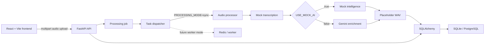
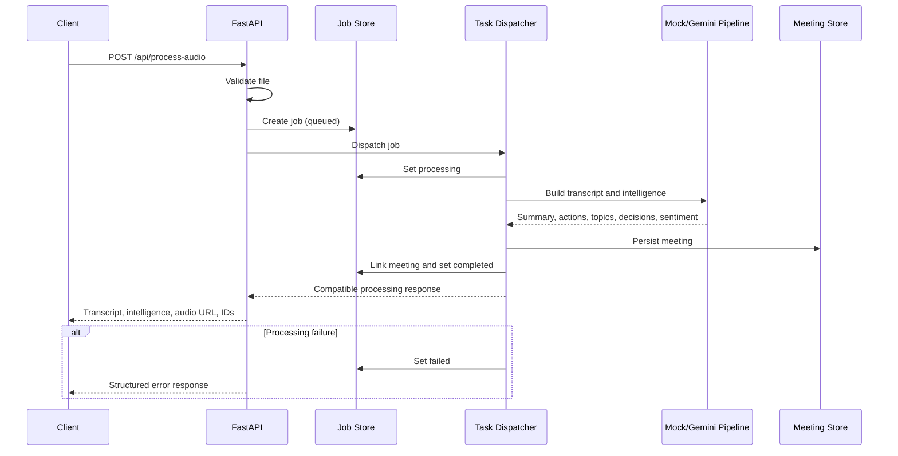

# Whisper

Whisper is a full-stack audio intelligence platform for uploading or recording meeting audio, generating structured meeting insights, and retaining searchable meeting history.

The project currently uses mocked transcription and a placeholder WAV audio summary. Gemini can enrich the mock transcript with summaries, action items, keywords, decisions, and sentiment. Real audio transcription and production text-to-speech are not implemented yet.

Repository: [ayushxt25/Whisper](https://github.com/ayushxt25/Whisper)

## Features

- Browser audio recording and file upload
- Development mock mode with no provider key required
- Gemini-powered meeting enrichment
- SQLite or PostgreSQL meeting persistence through SQLAlchemy
- Processing jobs with queued, processing, completed, and failed states
- Meeting history and detail retrieval
- Search across filenames, transcripts, summaries, action items, keywords, and decisions
- Extracted action items, keywords/topics, decisions, and sentiment
- Structured API errors and upload validation
- Configurable CORS, upload limits, provider mode, and processing mode
- Worker-ready task dispatcher with synchronous fallback

## Current Processing Modes

### Mock Mode

Set `USE_MOCK_AI=true` to run without an API key. The backend uses a realistic mock transcript, mock meeting intelligence, and a generated placeholder WAV file. Meetings and processing jobs are still persisted normally.

### Gemini Mode

Set `USE_MOCK_AI=false` and provide `GEMINI_API_KEY`. The current hybrid pipeline uses:

- Mock transcription
- Gemini summary and intelligence extraction
- Mock WAV audio summary

Users must provide their own Gemini API key for real provider mode. Never commit `.env` or expose API keys in frontend code.

## Architecture



## Job Flow

The API currently waits for processing to finish, preserving the original synchronous response. The job boundary is ready for a future external queue.



## Technology

| Layer | Technology |
| --- | --- |
| Frontend | React 19, Vite, Tailwind CSS, Framer Motion |
| Backend | FastAPI, Python 3.11+, Uvicorn |
| Persistence | SQLAlchemy, SQLite (local), PostgreSQL (deployment) |
| Intelligence | Google Gemini or local mock data |
| Processing | Synchronous task dispatcher; Redis configuration reserved for worker mode |

## API

| Method | Endpoint | Description |
| --- | --- | --- |
| `GET` | `/health` | Service health and environment |
| `POST` | `/api/process-audio` | Validate and process an uploaded audio file |
| `GET` | `/api/jobs/{job_id}` | Retrieve processing job state |
| `GET` | `/api/meetings` | List persisted meetings |
| `GET` | `/api/meetings/{meeting_id}` | Retrieve one meeting and its intelligence |
| `GET` | `/api/search?q={query}` | Search meeting content and metadata |
| `GET` | `/generated/{filename}` | Serve generated placeholder audio summaries |

Interactive API documentation is available at `http://127.0.0.1:8000/docs` while the backend is running.

## Local Setup

### Prerequisites

- Python 3.11+
- Node.js 20+
- npm
- A Gemini API key only when using Gemini mode

Clone the repository:

```powershell
git clone https://github.com/ayushxt25/Whisper.git
cd Whisper
```

### Backend

```powershell
cd backend
python -m venv .venv
.\.venv\Scripts\Activate.ps1
python -m pip install -r requirements.txt
Copy-Item .env.example .env
python -m uvicorn main:app --host 127.0.0.1 --port 8000
```

### Frontend

Open another terminal:

```powershell
cd frontend
npm install
Copy-Item .env.example .env
npm run dev
```

The frontend runs at `http://localhost:5173` and the backend at `http://127.0.0.1:8000`.

## Environment

Backend configuration lives in `backend/.env`. Start from `backend/.env.example`.

| Variable | Default | Purpose |
| --- | --- | --- |
| `APP_NAME` | `AI Voice Summarizer` | API service name |
| `APP_ENVIRONMENT` | `development` | Runtime environment label |
| `USE_MOCK_AI` | `true` | Select full mock mode |
| `GEMINI_API_KEY` | none | User-provided Gemini key |
| `GEMINI_MODEL` | `gemini-3.5-flash` | Gemini model identifier |
| `DATABASE_URL` | `sqlite:///./whisper.db` | SQLite locally; PostgreSQL URL in production |
| `PROCESSING_MODE` | `sync` | Task execution mode (`sync` or worker-ready fallback) |
| `REDIS_URL` | `redis://localhost:6379/0` | Reserved worker queue connection |
| `GENERATED_DIR` | `generated` | Generated audio directory |
| `MAX_UPLOAD_SIZE_MB` | `25` | Maximum upload size |
| `ALLOWED_AUDIO_EXTENSIONS` | configured list | Accepted filename extensions |
| `ALLOWED_AUDIO_MIME_TYPES` | configured list | Accepted MIME types |
| `CORS_ORIGINS` | local frontend origins | Allowed browser origins |
| `CORS_ALLOW_CREDENTIALS` | `false` | CORS credentials setting |
| `CORS_ALLOW_METHODS` | `GET,POST,OPTIONS` | Allowed CORS methods |
| `CORS_ALLOW_HEADERS` | `Content-Type,Authorization` | Allowed CORS headers |

Frontend configuration lives in `frontend/.env`:

```env
VITE_API_BASE_URL=http://localhost:8000
```

## Deployment: Vercel + Render + PostgreSQL

### 1. Render PostgreSQL

The included `render.yaml` creates a Render web service and a linked `whisper-postgres` database. For Supabase instead, create a PostgreSQL project and set the Render service's `DATABASE_URL` to its connection string.

The backend accepts `postgres://`, `postgresql://`, and `postgresql+psycopg://` URLs. SQLite remains the local default.

### 2. Render Backend

Create a Render Blueprint from this repository or configure a Web Service manually:

| Render setting | Value |
| --- | --- |
| Root Directory | `backend` |
| Runtime | Python |
| Build Command | `pip install -r requirements.txt` |
| Start Command | `uvicorn main:app --host 0.0.0.0 --port $PORT` |
| Health Check Path | `/health` |

Required Render environment variables:

```env
APP_ENVIRONMENT=production
DATABASE_URL=<Render or Supabase PostgreSQL connection string>
PROCESSING_MODE=sync
USE_MOCK_AI=true
CORS_ORIGINS=https://your-whisper-app.vercel.app
CORS_ALLOW_CREDENTIALS=false
GENERATED_DIR=/tmp/whisper-generated
```

For Gemini mode, also set `GEMINI_API_KEY` and change `USE_MOCK_AI=false`. Users must supply their own key. Keep `CORS_ORIGINS` restricted to the exact Vercel production URL, without a trailing slash. Add additional comma-separated origins only when needed.

### 3. Vercel Frontend

Import the repository into Vercel with these settings:

| Vercel setting | Value |
| --- | --- |
| Root Directory | `frontend` |
| Framework Preset | Vite |
| Install Command | `npm install` |
| Build Command | `npm run build` |
| Output Directory | `dist` |

Set this Vercel environment variable for Production and Preview as appropriate:

```env
VITE_API_BASE_URL=https://your-whisper-api.onrender.com
```

Redeploy the frontend after changing `VITE_API_BASE_URL`. After Vercel assigns the production domain, update Render's `CORS_ORIGINS` and redeploy the backend.

### Generated Audio Limitation

Generated WAV files are served correctly from `/generated`, but Render's default filesystem is ephemeral. Files stored under `/tmp/whisper-generated` can disappear after a restart, redeploy, or instance replacement. Meeting records remain in PostgreSQL, but old audio URLs may stop working. Production-grade durable audio requires object storage or a Render persistent disk, which is not implemented in the application yet.

### Database Lifecycle

The backend creates missing tables on startup. Use a formal migration tool before making production schema changes after launch. Do not use SQLite for a multi-instance Render deployment.

## Screenshots

> Placeholder: Dashboard with audio recording and upload controls.

> Placeholder: Processed meeting summary, actions, keywords, decisions, and sentiment.

> Placeholder: Meeting history and search results.

## License

Add the project license file and terms here.
